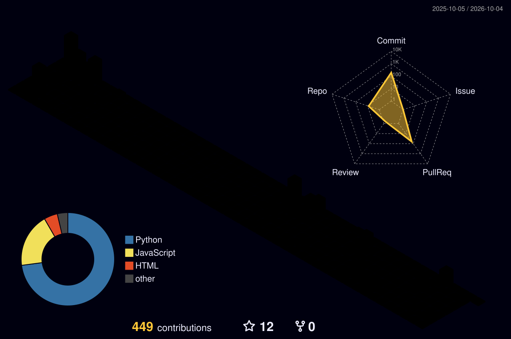

<div align="center">


<a href="#">
  
</a>

<br/>

<a href="https://kianooshvadaei.com/">
  
</a>
<a href="mailto:kia.vadaei@gmail.com">
  
</a>
<a href="https://www.linkedin.com/in/kia-vadaei-0aa58611b/">
  
</a>
<a href="https://t.me/kiavadaei">
  
</a>

</div>

---

## 👋 About Me

I'm a **Computer Engineer** with a strong interest in artificial intelligence and research, particularly at the intersection of **vision, language, multimodal learning, and robust machine learning**.

- 🔬 Research interests: **Multimodal Learning, NLP, Computer Vision, Explainability, Representation Learning, and Adversarial Robustness**
- 🧠 I enjoy turning research ideas into reproducible experiments and practical tools.
- 🐍 Most of my research and ML work is built with **Python and PyTorch**.
- 🛠️ I also work with **C++, C#, Linux, Django, .NET, Qt, and Flutter**.
- 🎹 Outside tech, I enjoy playing the **piano and dulcimer**.
- 📚 Interested in **philosophy, books, and video games**.

---

## 🌟 Featured Project

### [MK Unified SSL Toolbox](https://github.com/MK-SSL-Lab/mk-unified-ssl-toolbox)

A unified and modular toolbox for experimenting with **self-supervised learning across multiple modalities**.

<table>
<tr>
<td>🎧 <b>Audio</b></td>
<td>Wav2Vec2 · HuBERT · COLA · EAT · SpeechSimCLR</td>
</tr>
<tr>
<td>🖼️ <b>Vision</b></td>
<td>MAE</td>
</tr>
<tr>
<td>🧬 <b>Graph</b></td>
<td>GraphCL</td>
</tr>
<tr>
<td>🔀 <b>Cross-Modal</b></td>
<td>CLAP · AudioCLIP · Wav2CLIP</td>
</tr>
</table>

Built around **plug-and-play APIs** with PyTorch and Hugging Face integration, with support for distributed training, hyperparameter tuning, LoRA fine-tuning, and Weights & Biases tracking.

```bash
pip install mk-ssl
```

🌐 **[Project Website](https://mk-ssl-lab.github.io/mk-unified-ssl-toolbox/)** ·
⭐ **[GitHub Repository](https://github.com/MK-SSL-Lab/mk-unified-ssl-toolbox)**

---

## 🧰 Languages & Tools


<br/>


<br/>


<br clear="right"/>

---

## 📊 GitHub Overview

<div align="center">


</div>

---

## 🏙️ Contribution Skyline

<div align="center">



</div>

---

<div align="center">

### Thanks for visiting! 👋

<i>Researching, building, experimenting, and occasionally breaking things along the way.</i>

<br/><br/>


</div>


